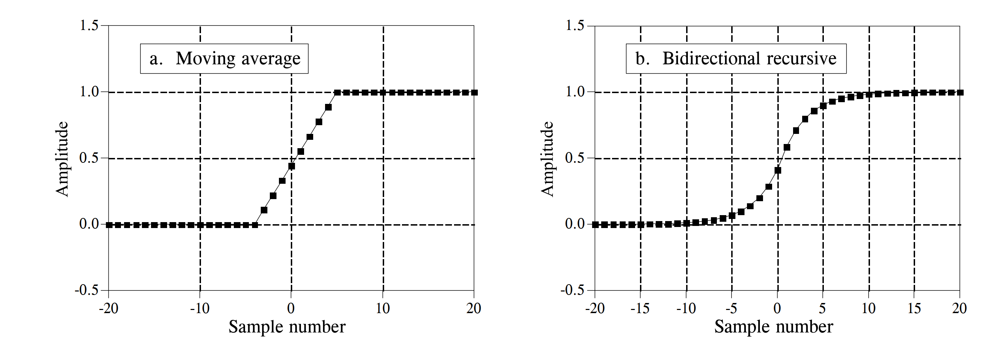
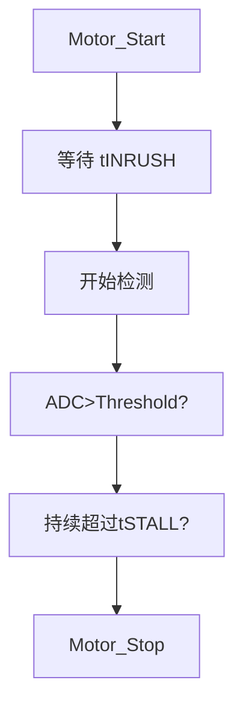

# 总体架构

```
├── ARM/          # 内核相关层 
├── App/          # 应用逻辑层
├── FW/           # 固件层
├── HW/           # 硬件驱动层
├── OS/           # 操作系统层
└── Project/      # 工程管理层
```


APP应用逻辑层：

- Main.c：程序入口，初始化系统并启动主循环
- Motor.c：具体功能模块
- KeyOne.c/ProcKeyOne.c：按键逻辑处理，KeyOne判断长按、短按与双击逻辑，ProcKeyOne执行对应任务函数

HW硬件驱动层：

- ADC.c/PWM.c：模数转换、脉冲调制、串口通信
- Timer.c：定时器配置
- RCC.c：时钟配置

FW固件库层：包括产家提供的固件库函数

ARM内核相关层：包括启动文件、SysTick配置等

Project工程管理层：存放集成开发环境的项目配置文件，编译输出路径


依赖关系：

```
App -> HW -> FW -> ARM
```

Motor.c需要调用PWM.c的接口来调节转速。

驱动程序需要调用ARM和FW。

# 电机

N20 减速马达： 3V 减速比118 转速34rpm

默认工作时间15min，状态机控制震动的频率/单次震动的时长，PWM频率为10kHz，PWM占空比控制速度

设定的震动模式有三种，通过按键切换：


## ADC 实时采样与滤波

滑动平均 vs 一阶低通


一阶低通RAM占用小，响应速度快，采用一阶低通滤波。

## 浪涌电流
启动时浪涌电流的持续期间 t_INRUSH，忽略高于固件失速阈值的 IPROPI 信号。
t_INRUSH 时序根据电机参数、电源电压和机械负载响应时间通过实验确定。




# 主控芯片

`stm32f103c8t6`

# 按键

KEY长按：长按1秒进行开/关机

短按：短按进行模式切换


# 电源管理

```
按键开机 → mcu接管电源使能 → 所有外设任务执行
       
插电    	→ LED开显示充电状态 其余关闭
```

## 电池电量换算
```c
float voltage = adc * 3.3f / 4095.0f;

```

# RGB灯
数量*3 
SPI驱动

